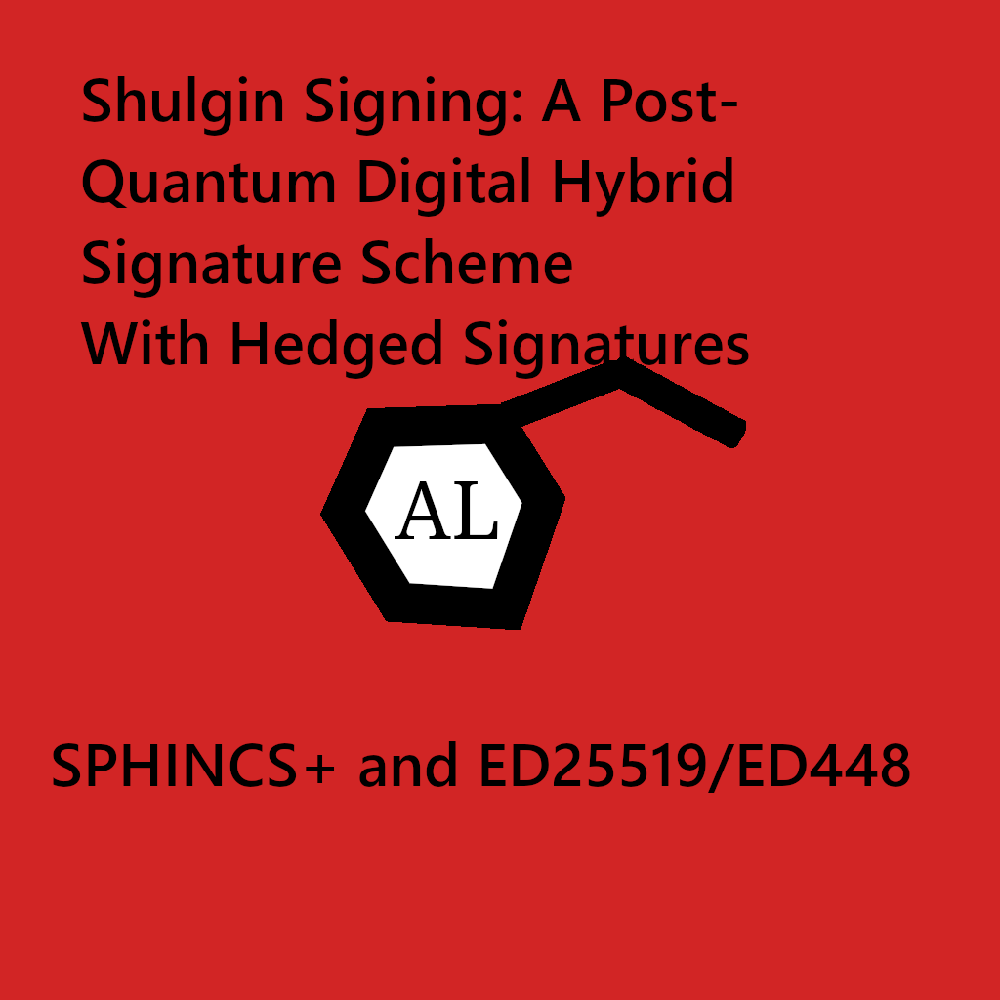

# ShulginSigning

## Abstract

In terms of keeping data secure and tamper-resistant, there comes a time when a new solution must be made to address previous and future concerns in regards to cryptography. Many digital signature algorithms have been used to keep data protect but in this paper, we present ShulginSigning, a hybrid digital signature mechanism for signing data with high-integrity/security for the prolonged future that is post-quantum secure based on the hardness of hash function collision resistance using SPHINCS+ (SHAKE256), and classically secure based on elliptic curves using Ed25519 or the better version Ed448, as specified in RFC 8032. It promotes security by also making concerns regarding how it should be implemented, with an approach that allows cryptographic randomness to be generated for ecc keypairs on top of the determinstic approach called **hedged signatures**.

This paper is easy to understand and presents this signing scheme to be used in places where high-integrity is desired.

## 1. Introduction

Digital Signatures are a technique is cryptography that allow a user to sign data with a cryptographic signature using public key cryptography. These allow one to verify the validility of the data/message against that of the public key and signature to see if it is really valid. There have been many public key systems used, including but not limited to, RSA, ECDSA, and EdDSA for signing.

The secret key is used to generate the signature from the given input and is validated by the public key and message.

These digital signatures have played an important role in everyday lives in securing the internet, blockchains, certificates, and more.

## 2. ShulginSignatures

`ShulginSignatures` are a hybrid digital signature scheme that use post-quantum cryptography with classical cryptography to guarantee the integrity of the signature. They are based on strong security assumptions and use the following algorithms:

* SPHINCS+ (using SHAKE256)
* Ed448 (SHAKE256) (with the addition of hedged signatures)

They are long-term solutions to signing in certain situations where high-integrity is needed. Both offer short public keys and private keys, while SPHINCS+ offers a large signature, that can be valid in certain situations. Due to the security assumptions behind SPHINCS+, we believe this will stand as a high-integrity signing mechanism.

## 2.1.1 Encoding of SPHINCS+ Signatures

Signatures for SPHINCS+ should be encoded in base58 to allow only needed characters to be shown to provide a simple interface.

## 2.1.1 SPHINCS+

SPHINCS+ is a stateless hash-based signing scheme that offers a large security margin. Due to the inherent security assumptions behind hash functions, we believe this will be a powerful signature scheme for post-quantum cryptography offering a large margin of security with simple measures. SPHINCS+ uses Haraka, SHA256, or SHAKE256, and in this instance, SHAKE256 should be preferred for optimal security. It has three categories of security, {1, 3, 5}. It is recomended to use security level 5 for high-security as there is not much of a difference aside from signature size.

SPHINCS+ makes use of a hypertree to make a tree of one-time digital signatures that can be created using the private key. SPHINCS+ uses a few-time signatures tree at the bottom known as FORS. It uses WOTS+ to sign.

This signature scheme remains high-integrity and is integral to creating a secure signing environment in the near future.

## 2.1.2 SPHINCS+ Chosen Hash Function

SHAKE256 is chosen as the hash-function because SHA256 has length-extension attacks and is considered less secure than SHA3 (SHAKE256, Keccak). It is more modern using the sponge function and has a larger internal state.

## 2.1.3 Shortening SPHINCS+ Signatures

SPHINCS+ Signatures can be shortened by hashing the signature and storing the hash instead in a manner where it can be retrieved easily by its identifier (the hash). This allows signatures to be kept small and integrity to still be intact.

## 3. Ed448 (with hedged signatures)

We present the usage of ED448, a determinstic signing elliptic curve based digital signature scheme with more security than its predecesssor, ed25519. This signature scheme uses SHAKE256 as opposed to SHA256 in ED25519. It would be highly likely that using it with a hedged signature (by generating cryptographic randomness for each signature on top of the deterministic signature) would make it a great candidate for ShulginSigning.

## 4. Conclusion

ShulginSigning offers a long-term solution for digital signatures. It offers post-quantum security with high security assumptions through the use of SPHINCS+ as well as classical security through the use of ED448 with hedged signatures.

It is robust and strict, offering lots of security.

## Resources

1. [Hedged ECDSA and EdDSA Signatures](https://www.ietf.org/archive/id/draft-irtf-cfrg-det-sigs-with-noise-03.html)
2. [SPHINCS+ Website](https://sphincs.org/)
3. [SPHINCS+ Whitepaper](https://sphincs.org/data/sphincs+-paper.pdf)
4. [RFC8032](https://datatracker.ietf.org/doc/html/rfc8032)
